# Pactuary

**AML & sanctions screening SaaS for compliance teams in Türkiye.**

-2f7d5b)

<picture>
  <source media="(prefers-color-scheme: dark)" srcset="assets/screenshots/04-alert-structuring-four-eyes-dark.webp">
  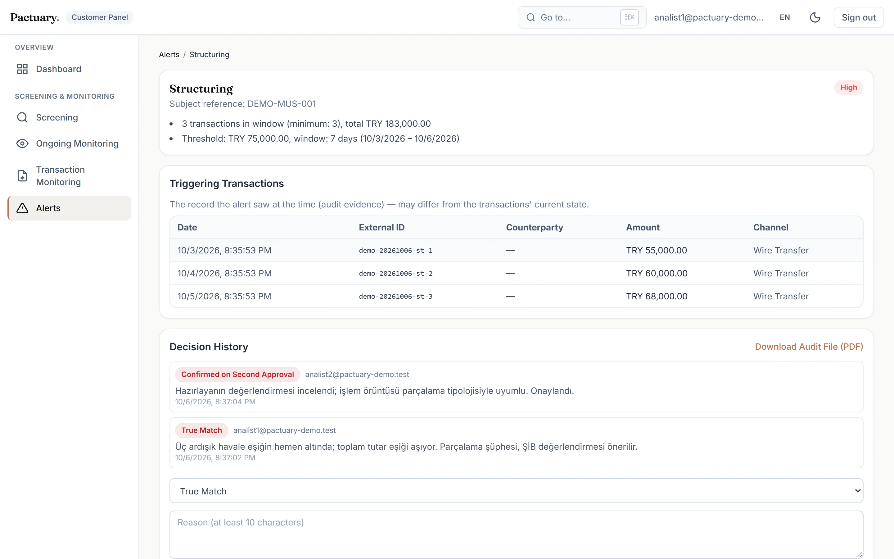
</picture>

**Website:** [pactuary-showcase.vercel.app](https://pactuary-showcase.vercel.app) · **Demo video:** [`assets/demo/`](assets/demo/)

> This is a code-free showcase. The product source code is private; I'm happy to walk through it in an interview.

---

## The problem

Compliance teams at Turkish banks, payment and e-money institutions have to screen every customer and counterparty against
sanctions and PEP lists, keep monitoring them after onboarding, and catch suspicious transaction patterns. They also have to
explain every decision to an auditor later. In practice this work is often split between spreadsheets, manual list
downloads and email approvals. That makes it slow, noisy with false positives, and hard to defend in an audit. The most
dangerous failure is a silent one: a list source that was down gets read as "no match", and nobody notices.

## What it does

| Module | What it does |
|---|---|
| **Name & PEP screening** | Screens people and companies against sanctions, PEP and watchlists (live OpenSanctions data plus the institution's own internal lists). Risk level comes from what the record *is* (sanction, crime, PEP), not from the name score. |
| **Batch screening** | Up to 100 subjects per request, with optional birth year and country to sharpen matching. |
| **Ongoing monitoring** | Re-screens the customer portfolio every night and raises an alert only for new matches. |
| **Transaction monitoring** | 5 typologies: single-threshold breach, high-risk country (FATF lists), counterparty sanctions/PEP match, structuring and velocity. Real-time rules run on ingest; pattern rules run in a nightly batch. Amounts are converted with TCMB exchange rates. |
| **Customer risk scoring** | A 0–100 score from four weighted factors (screening signal, transaction pattern, country, product/channel) with an explained breakdown. |
| **Alert & case management** | One inbox for all alert types. Every decision needs a written reason. With four-eyes enabled, a second, different analyst must approve. |
| **Audit trail & PDF** | Append-only decision history with a snapshot of what the analyst saw, and a one-click audit file per case. |
| **API & webhooks** | Scoped API keys for transaction ingestion and screening, plus HMAC-signed webhooks and email notifications for new alerts. |
| **Multi-tenancy** | Company-level isolation, three roles (platform admin, compliance manager, analyst) and separate quota pools per module. |

Adverse media is **provider-ready (stub)**: the interface, data model, API and screen are built, but no news vendor is connected
yet and the screen labels its output as sample data. KYC/CDD onboarding is on the **roadmap**.

## Screenshots

All customers, subjects and transactions are fictional (a synthetic "Pactuary Demo Bank"). Real names appear only as results
of screening against public sanctions lists.

<!-- Screens 01–03 (screening results, entity detail, batch screening) are added in the next update.

**Screening results.** Risk level, topics, match score and the source lists behind each match.

<picture>
  <source media="(prefers-color-scheme: dark)" srcset="assets/screenshots/01-screening-results-dark.webp">
  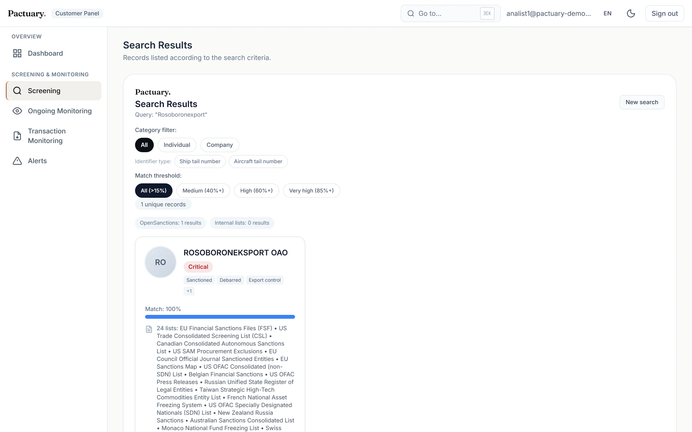
</picture>

**Entity detail and decision form.** Aliases, identifiers, sanctions programmes and source documents; the analyst records a decision with a mandatory reason.

<picture>
  <source media="(prefers-color-scheme: dark)" srcset="assets/screenshots/02-entity-detail-decision-dark.webp">
  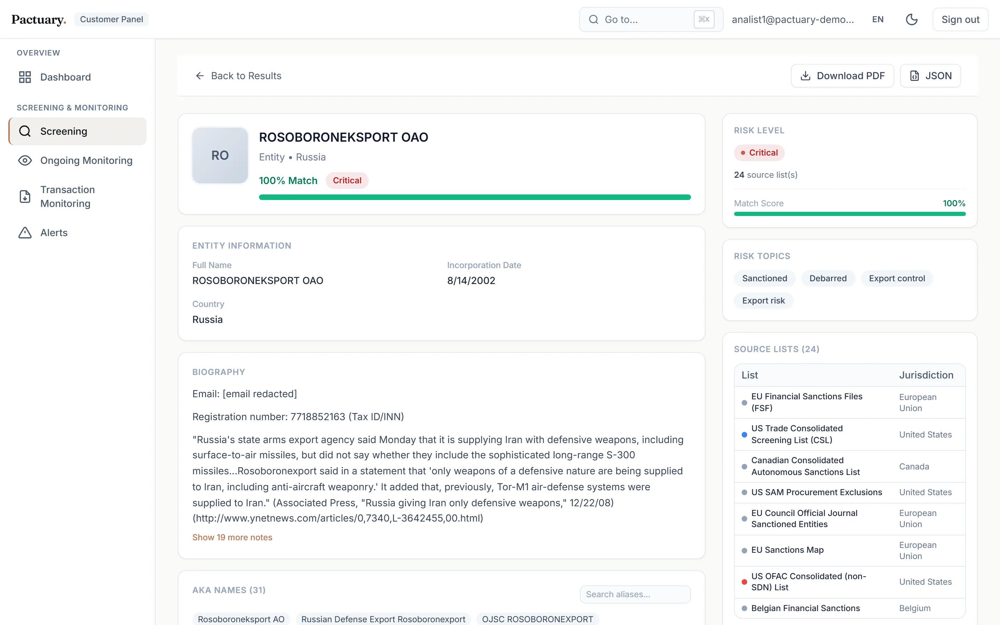
</picture>

**Batch screening.** A mixed portfolio screened in one request.

<picture>
  <source media="(prefers-color-scheme: dark)" srcset="assets/screenshots/03-batch-screening-dark.webp">
  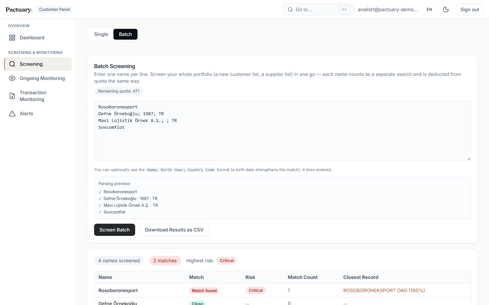
</picture>

-->

**Structuring alert with a completed four-eyes review.** Three transfers just under the threshold within 7 days; the maker's decision and the checker's approval are both on record.

<picture>
  <source media="(prefers-color-scheme: dark)" srcset="assets/screenshots/04-alert-structuring-four-eyes-dark.webp">
  
</picture>

**Waiting for second approval.** The first analyst marked the alert as a true match; a different analyst now approves or rejects it.

<picture>
  <source media="(prefers-color-scheme: dark)" srcset="assets/screenshots/05-alert-pending-second-approval-dark.webp">
  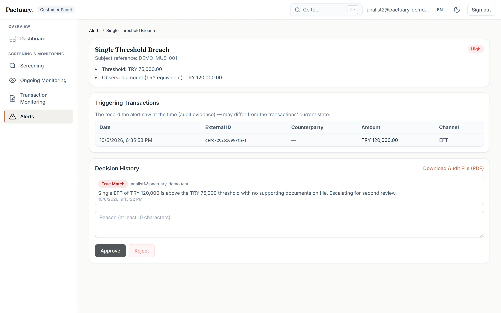
</picture>

**Rule settings.** Each typology can be switched on or off and tuned per company.

<picture>
  <source media="(prefers-color-scheme: dark)" srcset="assets/screenshots/06-rule-settings-dark.webp">
  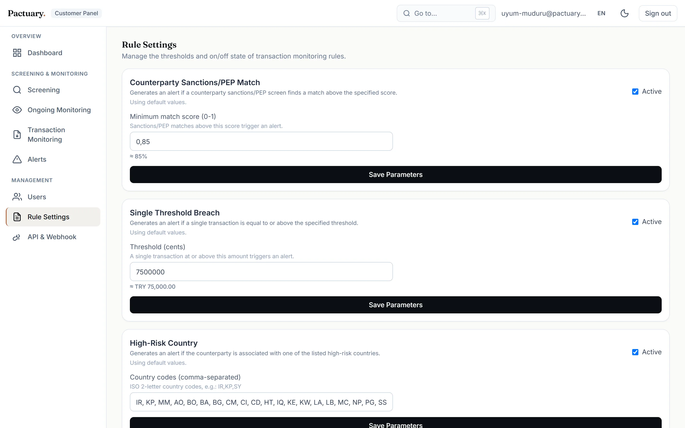
</picture>

**Customer risk score breakdown.** Each factor shows its sub-score, weight and the reason behind it.

<picture>
  <source media="(prefers-color-scheme: dark)" srcset="assets/screenshots/07-subject-risk-score-dark.webp">
  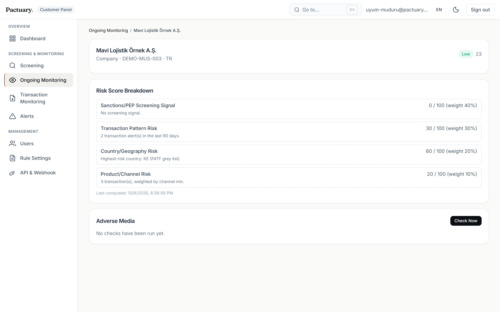
</picture>

**Company dashboard.** Pending alerts, quota pools per module and search activity.

<picture>
  <source media="(prefers-color-scheme: dark)" srcset="assets/screenshots/08-company-dashboard-dark.webp">
  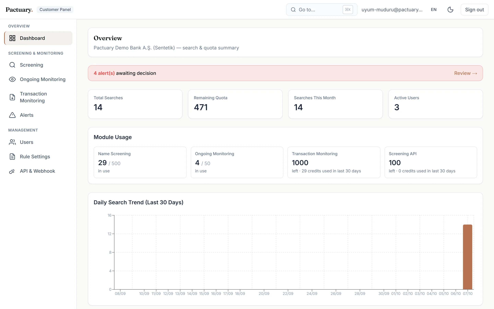
</picture>

**Unified alert inbox.** Monitoring and transaction alerts in one queue.

<picture>
  <source media="(prefers-color-scheme: dark)" srcset="assets/screenshots/09-unified-alert-inbox-dark.webp">
  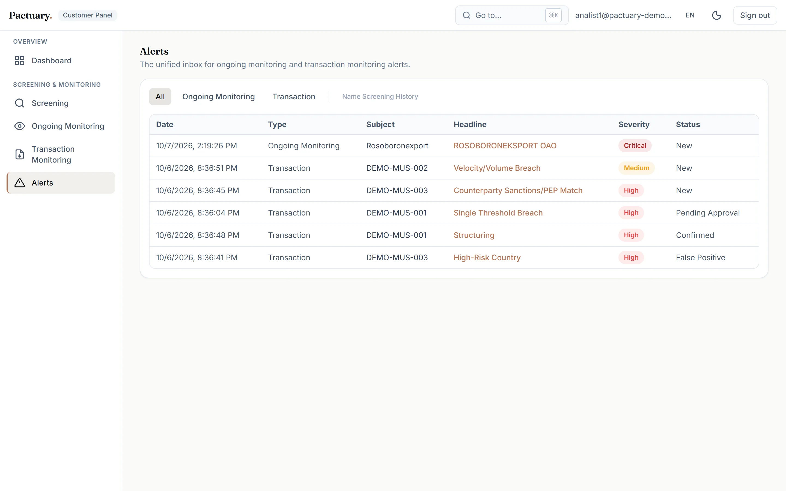
</picture>

**API keys.** Scoped keys; only the last four characters are ever shown again.

<picture>
  <source media="(prefers-color-scheme: dark)" srcset="assets/screenshots/10-api-keys-dark.webp">
  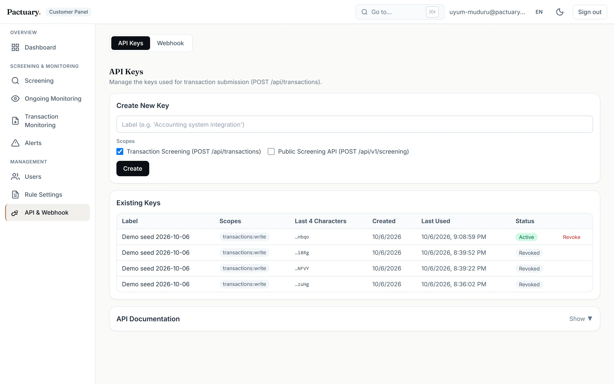
</picture>

**Transaction ledger.** Every ingested transaction, filterable by date, channel and counterparty.

<picture>
  <source media="(prefers-color-scheme: dark)" srcset="assets/screenshots/11-transaction-ledger-dark.webp">
  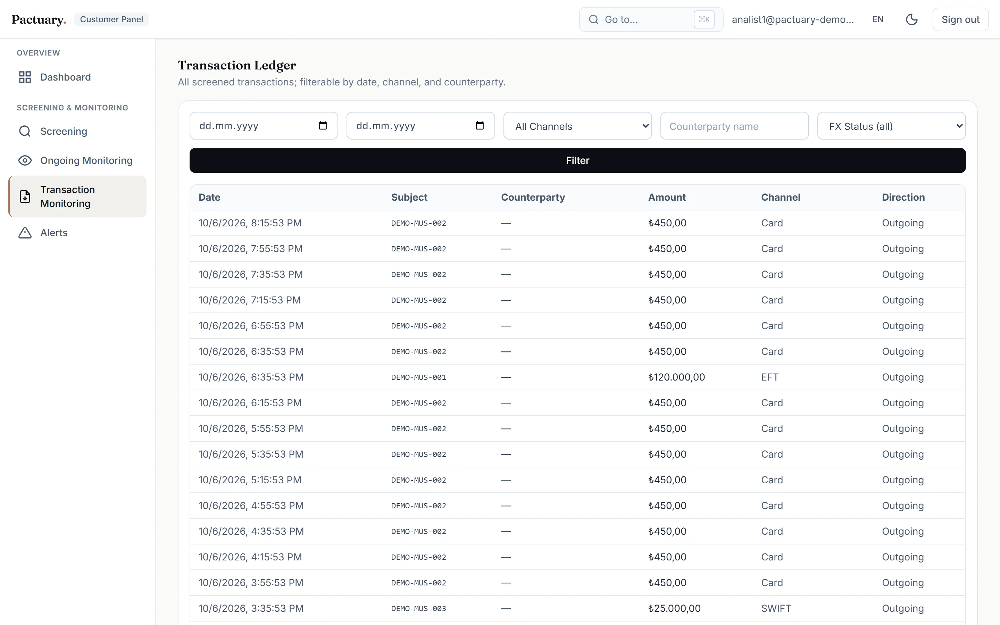
</picture>

**Audit file (first page).** Generated in Turkish, the language of the local regulator.

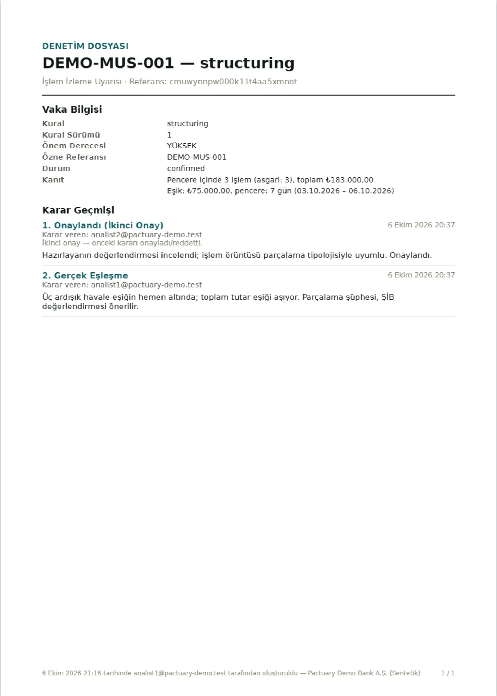

## How it works

### High-level architecture

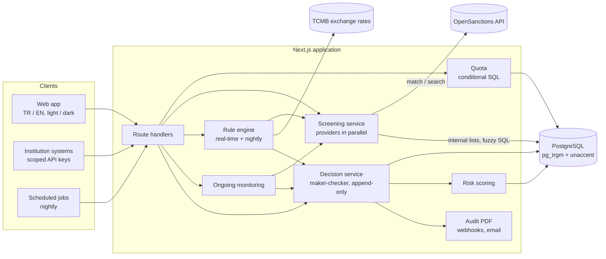

### Screening flow

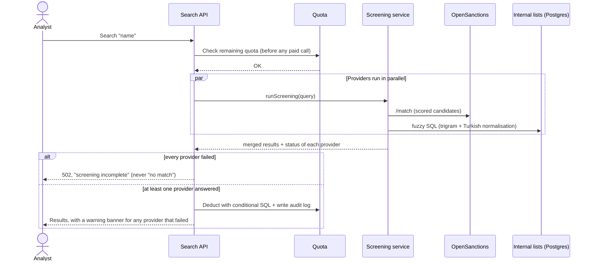

### Alert lifecycle

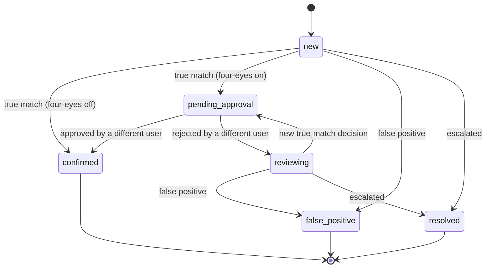

## Compliance design principles

- **An empty result is not "clear".** If a list source cannot be reached, the analyst is told. A failed provider is reported per
  request; if all of them fail the API returns an error instead of an empty list. A transaction rule that could not run returns
  `unavailable`, and a failed adverse media check is stored as failed, not as "no hits".
- **Four-eyes.** Per company, a true-match decision needs a second approval, and the system refuses self-approval.
- **Append-only decisions with snapshots.** Decisions are never edited; a change is a new record that points to the old one.
  Each decision stores a snapshot of the data at decision time, so an auditor sees what the analyst saw.
- **Risk-based approach.** Customers get an explained 0–100 risk score; country risk follows the FATF black and grey lists.
- **Risk level from topics, not from the match score.** A sanctioned entity and a local politician can have the same name score,
  but they carry very different risk. The level is derived from the record's topics (sanction → critical, crime → high,
  PEP → medium). The score only orders results.
- **Exchange rates are never guessed.** If a TCMB rate is missing, the transaction is held as "pending FX" and the
  amount-based rules run once the rate is available.

Designed around MASAK and FATF requirements. This is not a certification and makes no compliance guarantee; thresholds such as
the TRY 75,000 single-transaction limit are configurable starting values for each institution to validate.

## Matching benchmark

100 labelled queries run through the product's batch screening path (OpenSanctions `/match`, threshold 0.7, `sanctions`
collection), October 2026:

| | Result |
|---|---|
| Sanctioned names (25 canonical + 25 variants) | **50 / 50 matched**, all to the correct entity |
| Recall | **100%** |
| Precision | **80.6%** |
| False-positive rate | **24%** (12 of 50 clean names) |

- Variants included spelling changes, Turkish spellings (for example "Beşar Esad") and reversed name order; all were caught.
- **All 12 false positives came from common real-world names** (12 of 25; for example "Mehmet Kaya" matched a real namesake on a
  list). None of the 25 invented names produced a hit.
- Queries contained the name only. Secondary fields such as date of birth or nationality should reduce false positives, but
  **their effect was not measured**. The sample is small, so treat these numbers as indicative.

## Engineering quality

- **838 passing tests** (Vitest) and **88% line coverage** on the business-logic layer (`src/lib`; UI components and routes are
  outside the coverage scope).
- **TypeScript strict** across about 25k lines in 223 source files.
- **i18n:** Turkish and English with about 840 dictionary keys, plus light and dark themes.
- **Resilient external API client:** timeouts, retries with exponential backoff and jitter, `Retry-After` support, a TTL cache
  and request coalescing, so identical in-flight requests share one paid call. Errors map to a typed taxonomy.
- **Quota with conditional SQL:** quota is checked before any paid call and deducted with
  `UPDATE … WHERE remaining >= n RETURNING`, so concurrent requests cannot overspend.
- **Turkish-aware fuzzy matching** in Postgres: an immutable `search_normalize_tr()` function (İ/ı handling + unaccent) backed
  by a trigram index, order-insensitive token comparison and a word-boundary filter against noisy partial matches.
- **Secrets stay secret:** API keys are stored as SHA-256 hashes and shown in full only once; scheduled jobs are closed when
  their shared secret is missing.

## Tech stack

| Layer | Technology |
|---|---|
| Frontend | Next.js 16 (App Router), React 19, TypeScript, Tailwind CSS, Recharts |
| Backend | Next.js route handlers, Zod, pdfkit |
| Data | PostgreSQL (Supabase), Prisma, `pg_trgm`, `unaccent` |
| Auth | Supabase Auth (JWT verified server-side), scoped API keys |
| External data | OpenSanctions API, TCMB daily exchange rates |
| Quality | Vitest, ESLint, Playwright (screenshots) |
| Hosting | Vercel |

## Data sources & attribution

- **Sanctions and PEP data:** [OpenSanctions](https://www.opensanctions.org), licensed under
  [CC BY-NC 4.0](https://creativecommons.org/licenses/by-nc/4.0/). Pactuary queries the hosted OpenSanctions API. Under its
  standard terms, the API can be used to screen on behalf of customers and show the results in the product
  ([commercial FAQ](https://www.opensanctions.org/docs/commercial/faq/)). Commercial use of the bulk data requires a separate
  licence from OpenSanctions. The default scope is the `sanctions` collection: 95 lists including US OFAC SDN, the UN Security
  Council list, EU and UK sanctions, and the MASAK asset-freezing list.
- **Exchange rates:** Central Bank of the Republic of Türkiye (TCMB) daily rates.
- Screenshots show public sanctions records as returned by the API. All customer, subject and transaction data is synthetic.

## Roadmap

- Adverse media: connect a news screening vendor (the provider interface and screen are already in place).
- KYC / CDD / EDD onboarding workflows.
- Case assignment, work queues and SLAs.
- Phonetic matching and transliteration (for example Arabic and Cyrillic names) in the local matcher.
- OpenAPI specification for the public API.

## About the author

**Burak Esenoglu**, Software Developer. I own the product, architecture and compliance decisions behind Pactuary.
Development was AI-assisted with Claude Code.

[LinkedIn](https://www.linkedin.com/in/burakesnglu) · [GitHub](https://github.com/Burakesnglu)

Open to roles in AML / fraud prevention technology.

Source code is private; happy to walk through it in an interview.
